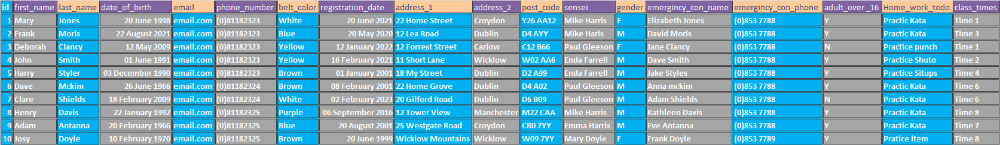
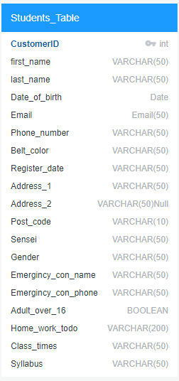

# Creator: Paul Gleeson

# Shotokan Karate

### [Ling to Shotokan github code](https://github.com/Shaga-Matula/Iceberg)
### [Link to Shotokan Heroku](https://shotokanapp-74a9ccbfcd2b.herokuapp.com)
&nbsp;

<!--  -->

&nbsp;

# Introduction

### The Shotokan website is designed to get potential karitka students interested in Shotokan Karate for a healthery lifestyle and healty state of mind. At first the student is presented with a landing page wich displays a hero image nav bar and for to contact us. If the student decideds to take up lessons there infor mation will be inputed into the registar through a form utilizing Django, Bootstrap and Python along side a postgresSql databae. 

## README Table Content

1.  [Introduction](#Introduction)
    1.  [Project Goals](#Project-Goals)
    2.  [User experience](#User-experience)
    3.  [Agile Aproach](#Agile-Aproach)
  
   

## Project Goals

* Create a site that is user friendly and gives the user a good quality of UX.
* Create a site that has a form to handle inital inquireys to the website.
* Use Agile to organise the project: Using methods of Epics\milestones and user stories. 

## User experience

* Create an atmosphere using creative writing that embeds the user to the task.
* Create a game that gives instant and clear feedback to the user during the game.
* Create a game that tracks and reports all errors with feedback to the user.
* Create a game that is challenging against a computer opponent.
* Accept upper and lower case input for letters in coordinates to speed up user experience. 
* Add help function to game so user can recall help at any time.
* Add quit game function so user can quit game if so desired.

## Agile Aproach

* User stories are implamented to assist the running of the project

## Design 

### Landing Page

### DataBase Design

### Normalizing definition
Normalizing a database table means organizing the information in a way that makes it easier to manage and prevents mistakes. It's like putting your toys away in a toy box so you can find them easily and don't lose any. In a database, we put similar information together in a table and make sure each piece of information is only stored in one place. This helps to avoid repeating information and makes it easier to update the information if needed. Normalizing a database table is like keeping your room clean and tidy so you can find everything you need quickly and easily.

### Pre-Normalizing 
This is the database table named "Students" before normalizing; it stores information about martial arts students. It has 20 fields, including a primary key field "CustomerID" and also relevant data values, such as Varchar and Boolean. Please note this is a mock-up and tables and data values may change during design and implementation. 

## Tools
### Responsinator :-   http://www.responsinator.com/?url=https%3A%2F%2F8000-shagamatula-pgcipp4-wgmitq7ua1e.ws-eu101.gitpod.io%2F
### QuickDBD : -       https://app.quickdatabasediagrams.com

